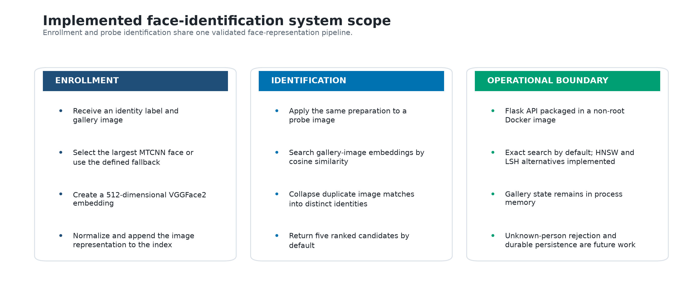

# Face Identification System — Engineering Report

## Executive summary

This project implements a face-identification backend that enrolls labeled
gallery images and returns ranked, distinct identity candidates for a probe
image. The implemented path combines MTCNN face preparation, a
VGGFace2-pretrained FaceNet embedding model, cosine-similarity retrieval, and a
Flask HTTP interface. Exact search is the runtime default; FAISS-backed HNSW and
LSH implementations provide compatible alternatives for future scale studies.

Three controlled experiments determined the operating configuration:

- VGGFace2 achieved 78.48% mean Top-1 accuracy across five probe conditions,
  compared with 17.72% for CASIA-WebFace.
- MTCNN crop/fallback preprocessing raised clean Top-1 accuracy from 82.28% to
  93.29% on the same 999 probes, with a paired 95% interval of +8.41 to
  +13.61 percentage points and 100% processing coverage.
- Five returned identities were the shortest candidate list to reach the
  declared 95% closed-set coverage target. Two gallery images per identity
  captured most of the measured enrollment benefit on the controlled
  123-identity subset.

These results define a practical closed-set identification baseline. They do
not establish unknown-person rejection, biometric fairness, or production-scale
latency guarantees; those remain separate evaluation requirements.

## 1. System boundary and runtime architecture

The service supports two workflows. `POST /add` accepts an image and identity,
prepares the face, creates a 512-dimensional embedding, and adds the
image-level representation to an in-memory gallery index. `POST /identify`
applies the same transformation to a probe, searches the gallery, consolidates
multiple image matches for the same person, and returns ranked identities.

**Figure 1. Implemented system scope**

**Interpretation.** Enrollment and identification reuse the same
face-preparation and embedding path. Durable gallery state and open-set
rejection are intentionally outside the implemented boundary rather than
implied as current capabilities.

**Table 1. Runtime responsibilities**

| Stage | Implementation | Responsibility |
|---|---|---|
| HTTP interface | [`create_app`](../identification_service/app.py) | Validate multipart requests, expose enrollment and identification routes, and serialize structured responses |
| Workflow orchestration | [`IdentificationService`](../identification_service/app.py) | Coordinate the shared representation path, gallery mutation, and identity ranking while guarding model inference |
| Face preparation | [`FacePreprocessor`](../identification_service/modules/extraction/preprocessing.py) | Normalize orientation and color, select the largest valid MTCNN detection, apply the controlled fallback, and resize the input |
| Embedding extraction | [`FaceEmbeddingExtractor`](../identification_service/modules/extraction/embedding.py) | Standardize prepared faces and produce L2-normalized 512-dimensional FaceNet embeddings |
| Image-level retrieval | [`ExactCosineIndex`](../identification_service/modules/retrieval/index/bruteforce.py), [`HNSWCosineIndex`](../identification_service/modules/retrieval/index/hnsw.py), and [`LSHCosineIndex`](../identification_service/modules/retrieval/index/lsh.py) | Store image embeddings and return similarity-ranked gallery-image matches through a common index contract |
| Identity ranking | [`rank_identities`](../identification_service/modules/retrieval/search.py) | Collapse multiple gallery-image matches into distinct identity candidates and assign response ranks |

**Interpretation.** Image preparation, representation, indexing, identity
consolidation, and transport are separate responsibilities. The HTTP layer does
not duplicate retrieval mathematics, and the shared index contract allows the
retrieval backend to change without changing the identity-ranking policy.

The representation path is shared so that enrollment and probe images are
processed consistently:

1. apply EXIF orientation and convert the image to RGB;
2. detect faces with MTCNN and select the largest valid face;
3. use the complete image when detection fails, preserving request coverage;
4. resize to 160 × 160 and standardize pixel values;
5. extract a 512-dimensional VGGFace2 embedding;
6. L2-normalize embeddings before cosine retrieval.

The default [`ExactCosineIndex`](../identification_service/modules/retrieval/index/bruteforce.py)
provides deterministic exhaustive search at the current gallery scale.
[`HNSWCosineIndex`](../identification_service/modules/retrieval/index/hnsw.py)
and [`LSHCosineIndex`](../identification_service/modules/retrieval/index/lsh.py)
implement the same search contract, allowing retrieval backends to change
without changing identity-ranking behavior.

## 2. Embedding checkpoint selection

The first experiment isolated representation quality before introducing face
cropping. Both supported InceptionResnetV1 checkpoints received the same 2,265
gallery images and 999 probes, using full-image resizing and exact cosine
retrieval. Each probe was evaluated clean and under blur, reduced resolution,
darkening, and brightening.

*Figure 2. Checkpoint quality and stability across five conditions. VGGFace2
outperformed CASIA-WebFace on Top-1, mean reciprocal rank, and Rank-1 stability
for every tested condition.*

**Table 2. Embedding checkpoint decision evidence**

| Selection measure | VGGFace2 | CASIA-WebFace |
|---|---:|---:|
| Clean Top-1 | **82.28%** | 22.72% |
| Mean Top-1 across conditions | **78.48%** | 17.72% |
| Worst-condition Top-1 | **74.17%** | 13.71% |
| Mean reciprocal rank | **83.86%** | 24.26% |
| Mean Rank-1 changed rate | **13.34%** | 60.04% |

**Interpretation.** VGGFace2 won the declared primary metric without requiring a tie-breaker and
was selected for the runtime. Reduced resolution was its most damaging tested
condition: Top-1 fell to 74.17%, although Top-5 remained 88.39%. The gap between
those values shows that many degraded probes still placed the correct identity
near the top even when it was not first.

The comparison is a system-level checkpoint decision on this corpus, not an
independent claim about generalization. The checkpoints' pretraining identities
may overlap with the evaluation population.

## 3. Face-preprocessing policy

Experiment 02 held the selected checkpoint, gallery, probe set, standardization,
search, and ranking policy constant. It changed only the input preparation:
complete-image resizing versus MTCNN crop with a controlled full-image fallback.

MTCNN detected a face in 3,263 of 3,264 images. The single miss used the defined
fallback, so no image was dropped. The paired comparison then evaluated both
policies on the same 999 probe identities.

*Figure 3. Controlled preprocessing comparison. Cropping produced 149 Top-1
wins against 39 losses and improved first-choice accuracy by 11.01 percentage
points. The paired interval excludes zero.*

**Table 3. Paired face-preprocessing results**

| Endpoint | Full image | MTCNN crop/fallback | Difference |
|---|---:|---:|---:|
| Top-1 | 82.28% | **93.29%** | **+11.01 pp** |
| Top-3 | 89.59% | **94.79%** | +5.21 pp |
| Top-5 | 92.19% | **95.10%** | +2.90 pp |
| Top-10 | 94.59% | **95.40%** | +0.80 pp |
| Mean reciprocal rank | 0.8677 | **0.9411** | +0.0734 |

**Interpretation.** A deterministic paired bootstrap placed the 95% Top-1 improvement interval at
+8.41 to +13.61 points. Exact McNemar testing produced
`p = 2.38 × 10⁻¹⁶`. The result supports crop/fallback as the runtime default,
while the paired failure tail explains why fallback and preprocessing metadata
remain operationally important. A confident face detection can still choose
the wrong person in a multi-person image.

## 4. Retrieval configuration

The final experiment converted a strong ranking pipeline into explicit service
defaults. It addressed two different questions: how many identities the API
should return and how many gallery images should represent an identity when
additional enrollment images are available.

### 4.1 Candidate-list length

*Figure 4. Candidate coverage versus response length. Five identities are the
shortest list reaching the declared 95% closed-set target; expanding from five
to fifty recovers only five additional probes.*

**Table 4. Candidate-list coverage**

| Returned identities | Correct probes | Coverage | Missed probes |
|---:|---:|---:|---:|
| 1 | 932 | 93.29% | 67 |
| 3 | 947 | 94.79% | 52 |
| **5** | **950** | **95.10%** | **49** |
| 10 | 953 | 95.40% | 46 |
| 50 | 955 | 95.60% | 44 |

**Interpretation.** The runtime therefore uses `k=5` when the client does not provide a positive
override. This is a response-policy decision, not an unknown-person threshold:
all evaluated probes belong to enrolled identities.

### 4.2 Gallery images per identity

*Figure 5. Gallery-depth trade-off across 30 deterministic nested trials on the
same 123 identities. The second image provides the dominant quality gain and
reduces sensitivity to which enrollment photograph is selected.*

**Table 5. Gallery-depth decision evidence**

| Images per identity | Mean Top-1 | Trial range | Incremental gain |
|---:|---:|---:|---:|
| 1 | 94.44% | 91.06–96.75% | — |
| **2** | **97.99%** | **95.93–99.19%** | **+3.55 pp** |
| 3 | 98.54% | 97.56–99.19% | +0.54 pp |
| 5 | 98.75% | 98.37–99.19% | +0.14 pp from `m=4` |

**Interpretation.** Two images were the smallest depth within one percentage point of the
five-image reference. The service accepts a single image because the evidence
supports a recommendation, not a hard enrollment constraint. Only 123 of the
1,000 gallery identities had at least five images, so this result is scoped to
that fixed, well-represented subset.

## 5. Service packaging, verification, and reproducibility

The Flask application validates image uploads and positive candidate counts,
returns structured preprocessing metadata, and reports an empty-gallery request
as a conflict rather than a successful empty identification. Enrollment and
identification share one service instance guarded around model inference.

The Docker image uses Python 3.11, pinned CPU dependencies, a non-root user, and
one Gunicorn worker with four threads. A single worker is intentional because
gallery state currently lives in process memory; multiple worker processes
would otherwise maintain inconsistent galleries. The pretrained-model cache is
mounted separately so model files persist across container runs.

GitHub Actions installs the pinned dependency set, checks package consistency,
runs the functional and analytical unit suite, builds the container, and
validates the non-root runtime, routes, dependencies, and Gunicorn settings.

**Table 6. Reproduction entry points**

| Concern | Command or entry point |
|---|---|
| Runtime HTTP service | `python -m identification_service.app` |
| Containerized service | `docker build --file identification_service/Dockerfile --tag face-identification-system .` |
| Test suite | `python -m unittest discover -s tests -v` |
| Dataset inventory | `experiments/scripts/01_embedding_robustness/01_prepare_dataset.py` |
| Embedding checkpoint comparison | `experiments/scripts/01_embedding_robustness/02_run_comparison.py` |
| Face-detection audit | `experiments/scripts/02_face_preprocessing/01_audit_preprocessing.py` |
| Preprocessing retrieval comparison | `experiments/scripts/02_face_preprocessing/02_compare_retrieval.py` |
| Retrieval configuration | `experiments/scripts/03_retrieval_configuration/01_analyze_configuration.py` |

**Interpretation.** Runtime operation, functional verification, and each
controlled experiment have explicit clean-clone entry points. Full experiment
runs additionally require the external gallery and probe assets described by
the repository data policy.

## 6. Limitations and next engineering work

- The evaluation is closed-set; similarity-threshold calibration and
  unknown-person rejection require enrolled and non-enrolled probes.
- The gallery index is in memory and is cleared by a restart. A durable shared
  index is required before using multiple service processes.
- HNSW and LSH satisfy the common retrieval contract, but their latency,
  memory, and recall trade-offs have not been benchmarked at production scale.
- The largest-face rule can select the wrong subject in multi-person images.
  Enrollment UX or explicit face selection would reduce that risk.
- The corpus does not support a comprehensive demographic fairness assessment.
- Additional cameras, compression regimes, poses, occlusions, and enrollment
  ages are needed before treating the measured accuracy as a deployment
  guarantee.

The next engineering priorities are durable gallery persistence, open-set
threshold evaluation, explicit multi-face handling, and scale testing for the
approximate retrieval backends.

## 7. Detailed experiment evidence

- [Experiment 01 — embedding checkpoint robustness](../experiments/reports/01_embedding_robustness/REPORT.md)
- [Experiment 02 — face preprocessing](../experiments/reports/02_face_preprocessing/REPORT.md)
- [Experiment 03 — retrieval configuration](../experiments/reports/03_retrieval_configuration/REPORT.md)

The detailed reports document each controlled comparison, decision rule,
supporting table, limitation, and implementation path.
