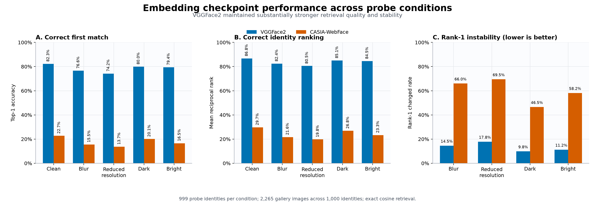
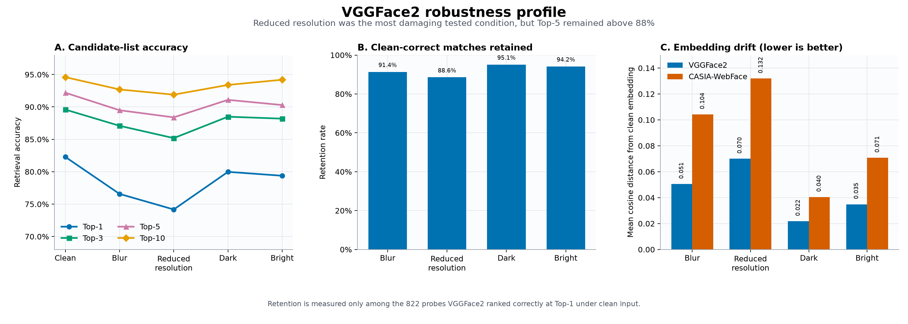
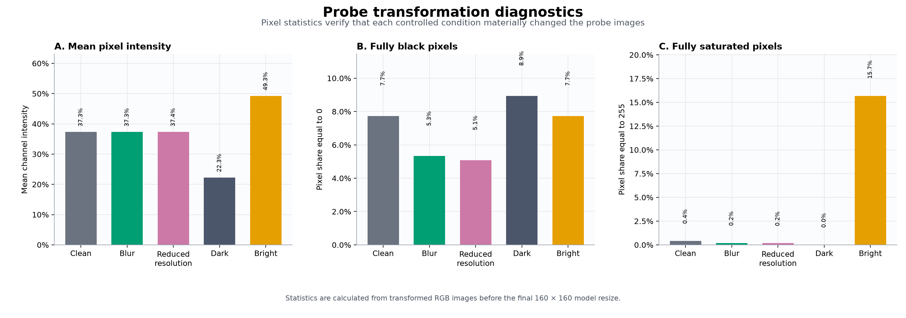

# Experiment 01: Embedding Checkpoint Robustness

## Decision

VGGFace2 was selected as the embedding checkpoint for the identification
service. Across five equally weighted probe conditions, it achieved 78.48%
mean Top-1 accuracy compared with 17.72% for CASIA-WebFace. Its weakest
condition still achieved 74.17% Top-1 accuracy, more than three times the
CASIA-WebFace clean baseline of 22.72%.

The selection was determined by the declared primary metric, mean Top-1
accuracy across conditions. The tie-breakers were not required.

| Selection measure | VGGFace2 | CASIA-WebFace |
|---|---:|---:|
| Clean Top-1 | 82.28% | 22.72% |
| Mean Top-1 across conditions | **78.48%** | 17.72% |
| Worst-condition Top-1 | **74.17%** | 13.71% |
| Mean reciprocal rank | **83.86%** | 24.26% |
| Mean rank-1 changed rate | **13.34%** | 60.04% |
| Mean cosine embedding drift | **0.0443** | 0.0868 |

## Why this experiment was necessary

The embedding model converts a face image into a 512-dimensional vector. Every
later retrieval decision depends on whether vectors from the same identity are
close and vectors from different identities are separated. Index selection or
API design cannot recover identity information that the embedding model failed
to preserve.

This experiment therefore compared the two supported InceptionResnetV1
checkpoints before evaluating face-cropping or retrieval-index configuration:

- `vggface2`
- `casia-webface`

The comparison addressed two questions:

1. Which checkpoint produces the strongest identity ranking on clean probes?
2. Which checkpoint best preserves that ranking under controlled image
   degradation?

## Evaluation design

The verified corpus contains 2,265 gallery images representing 1,000 identities
and 999 probe images representing 999 identities. Every probe identity is
present in the gallery. One gallery-only identity remains as an additional
distractor.

Each model received the same images and processing policy. Images were oriented
from EXIF metadata, converted to RGB, resized to 160 × 160, and standardized
with `(pixel - 127.5) / 128`. The resulting embeddings were L2-normalized and
compared with exact cosine similarity.

Multiple gallery images belonging to one person were consolidated into a
single identity result using that identity's strongest image-level similarity.
This prevents identities with more gallery images from occupying multiple rank
positions.

The gallery remained clean. Every probe was evaluated under five conditions:

| Condition | Transformation | Purpose |
|---|---|---|
| Clean | No degradation | Establish the reference result |
| Blur | Gaussian blur, radius 2 | Measure sensitivity to lost edge detail |
| Reduced resolution | Downsample to 64 × 64, then enlarge | Measure sensitivity to lost spatial detail |
| Dark | Brightness factor 0.60 | Measure low-illumination sensitivity |
| Bright | Brightness factor 1.40 | Measure overexposure and clipping sensitivity |

Face detection and cropping were intentionally excluded. Full-image processing
isolated the embedding checkpoint as the independent variable; preprocessing is
evaluated separately in Experiment 02.

## Comparative results

*Figure 1. Checkpoint comparison across all probe conditions. VGGFace2 delivered
higher Top-1 accuracy and MRR while changing its first-ranked identity much less
frequently under degradation. Each condition contains 999 probes.*

VGGFace2 outperformed CASIA-WebFace in every condition and on every reported
retrieval measure. The margin was not limited to clean input: VGGFace2's
reduced-resolution Top-1 result exceeded CASIA-WebFace's clean result by 51.45
percentage points.

CASIA-WebFace also showed substantially greater instability. Degradation
changed its first-ranked identity for an average of 60.04% of probes, compared
with 13.34% for VGGFace2. Its average embedding drift was approximately twice
that of VGGFace2.

## Selected-checkpoint behavior

| Probe condition | Top-1 | Top-3 | Top-5 | Top-10 | MRR | Top-1 drop from clean |
|---|---:|---:|---:|---:|---:|---:|
| Clean | 82.28% | 89.59% | 92.19% | 94.59% | 86.77% | — |
| Dark | 79.98% | 88.49% | 91.09% | 93.39% | 85.06% | 2.30 pp |
| Bright | 79.38% | 88.19% | 90.29% | 94.19% | 84.50% | 2.90 pp |
| Blur | 76.58% | 87.09% | 89.49% | 92.69% | 82.42% | 5.71 pp |
| Reduced resolution | 74.17% | 85.19% | 88.39% | 91.89% | 80.53% | 8.11 pp |

*Figure 2. VGGFace2 robustness profile. Reduced resolution caused the largest
accuracy loss, lowest clean-correct retention, and greatest embedding drift.
Candidate-list accuracy nevertheless remained above 88% at Top-5.*

Reduced resolution was the hardest tested condition. It removed fine facial
detail that cannot be recovered by enlarging the image. Under that condition,
VGGFace2 retained 88.56% of the 822 probes it originally ranked correctly at
Top-1. Blur was the next most damaging condition. Both brightness conditions
produced smaller losses.

The Top-k results also distinguish severe errors from near misses. Under reduced
resolution, Top-1 fell to 74.17%, while Top-5 remained 88.39%. This indicates
that the correct identity often remained near the top even when it was no
longer ranked first.

## Transformation validation

*Figure 3. Probe-level pixel diagnostics before the final model resize. The
brightness transformations changed mean intensity as intended, while blur and
resizing reduced exact pixel extremes through interpolation.*

Darkening reduced mean channel intensity from 37.33% to 22.26%. Brightening
raised it to 49.28% and saturated 15.69% of pixels. These measurements confirm
that the robustness results correspond to material changes in probe appearance,
not mislabeled or ineffective transformations.

## Engineering decision and downstream impact

The identification service uses the VGGFace2-pretrained checkpoint as its
default embedding backend. The selection is supported by accuracy, ranking
quality, prediction stability, and representation stability—not one isolated
metric.

The results also set the reference for Experiment 02. That experiment will hold
VGGFace2 constant while evaluating MTCNN-guided face cropping and controlled
fallback behavior. Separating the decisions prevents checkpoint differences
from being confused with preprocessing effects.

## Limitations

- The evaluation is closed-set: every probe identity exists in the gallery. It
  does not measure unknown-person rejection or similarity-threshold calibration.
- The checkpoints' original training data may overlap with identities in this
  corpus. The results are a controlled system comparison, not a guaranteed
  independent generalization benchmark.
- The five conditions are weighted equally because no production frequency
  distribution is available.
- The degradations are deterministic simulations; they do not represent every
  camera, compression, pose, or illumination failure mode.
- Full-image resizing isolates embedding behavior but does not represent the
  final MTCNN-guided runtime pipeline.

## Reproducibility

- Dataset preparation: [`01_prepare_dataset.py`](../../scripts/01_embedding_robustness/01_prepare_dataset.py)
- Checkpoint comparison: [`02_run_comparison.py`](../../scripts/01_embedding_robustness/02_run_comparison.py)
- Figure generation: [`03_generate_figures.py`](../../scripts/01_embedding_robustness/03_generate_figures.py)
- Canonical outputs: [`outputs/01_embedding_robustness`](../../outputs/01_embedding_robustness/)
- Runtime embedding implementation: [`embedding.py`](../../../identification_service/modules/extraction/embedding.py)

The canonical run used Python 3.11, CPU inference, batch size 32,
`facenet-pytorch 2.5.3`, `torch 2.12.1`, and `numpy 2.4.6`. The run manifest
records the dataset fingerprint, dependency versions, processing policy, and
SHA-256 hash of every result table.
