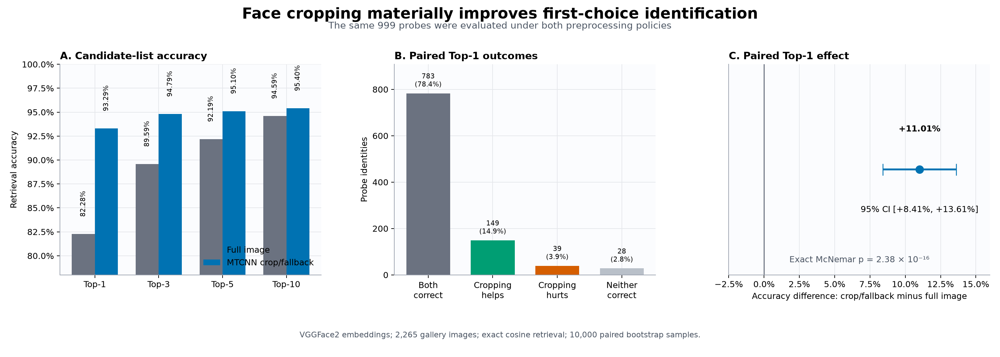
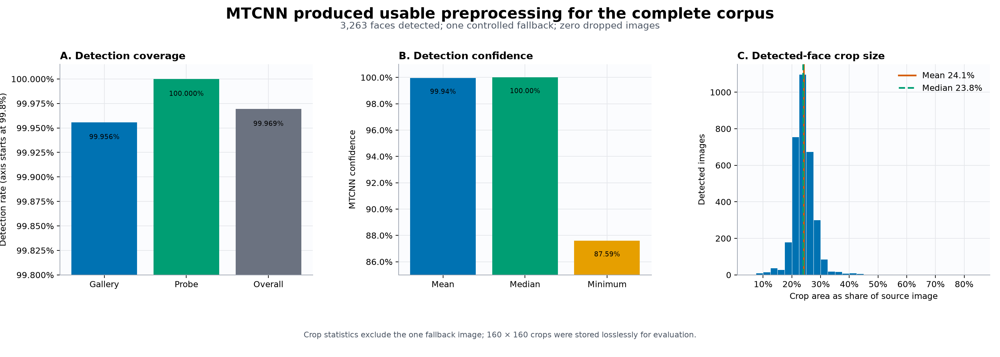
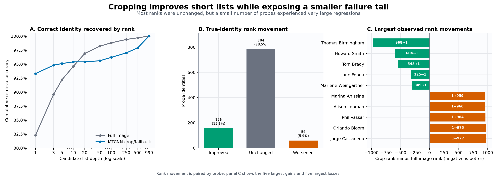

# Experiment 02: Face Preprocessing

## Decision

MTCNN-guided face cropping with a controlled full-image fallback is retained as
the default preprocessing policy. Against full-image resizing, it increased
Top-1 identification accuracy from 82.28% to 93.29% on the same 999 probe
identities: a gain of 11.01 percentage points, or 110 additional correct
first-ranked identities.

The decision satisfied every requirement declared before the full comparison.
The paired 95% bootstrap interval was +8.41 to +13.61 percentage points, the
exact McNemar p-value was `2.38 × 10⁻¹⁶`, mean reciprocal rank improved by
0.0734, and the fallback policy preserved 100% processing coverage.

**Table 1. Preprocessing-policy decision scorecard**

| Decision measure | Full image | MTCNN crop/fallback | Difference |
|---|---:|---:|---:|
| Top-1 accuracy | 82.28% | **93.29%** | **+11.01 pp** |
| Top-3 accuracy | 89.59% | **94.79%** | +5.21 pp |
| Top-5 accuracy | 92.19% | **95.10%** | +2.90 pp |
| Top-10 accuracy | 94.59% | **95.40%** | +0.80 pp |
| Mean reciprocal rank | 0.8677 | **0.9411** | +0.0734 |
| Processing coverage | 100% | 100% | — |

**Interpretation.** Crop/fallback improves every reported retrieval endpoint
while preserving complete processing coverage, satisfying all four declared
adoption requirements.

*Figure 1. Controlled retrieval comparison. Cropping improved every reported
Top-k endpoint and MRR. In the paired Top-1 analysis, it fixed 149 probes and
broke 39, yielding 110 net additional correct first-ranked identities.*

**Interpretation.** The aggregate decision does not imply that every crop was beneficial. Cropping
introduced a smaller but important failure tail, including several very large
rank regressions. The selected policy therefore combines cropping with an
explicit fallback and exposes preprocessing metadata for operational review.

## Why this experiment was necessary

Experiment 01 selected the VGGFace2 embedding checkpoint using full-image input.
That isolated model quality, but it did not determine how production images
should be prepared. A face occupies only part of many source images. Removing
background, clothing, and unrelated scene content can make the identity signal
more prominent before embedding extraction. Conversely, a detector can miss a
face or select the wrong person when several faces are visible.

This experiment separated those effects into two questions:

1. Can MTCNN produce a usable face crop across the complete corpus without
   dropping images?
2. Does using those crops improve identity retrieval when all other system
   components remain fixed?

The detection audit established processing coverage first. The paired retrieval
comparison then evaluated ranking quality under adoption criteria declared
before the complete comparison was run.

## Evaluation design

The verified corpus contains 2,265 gallery images representing 1,000 identities
and 999 probe images representing 999 identities. Every probe identity appears
in the gallery; one gallery-only identity remains as an additional distractor.

The preprocessing audit used `facenet-pytorch` MTCNN with a 20-pixel margin. If
multiple faces were detected, the largest bounding box was selected. Successful
crops were resized to 160 × 160 and retained losslessly for evaluation. If no
face was detected—or detector execution failed—the complete image was resized
instead. This fallback prevents preprocessing from silently removing an image
from enrollment or identification.

The retrieval comparison changed only preprocessing:

**Table 2. Controlled retrieval-comparison design**

| Controlled component | Policy |
|---|---|
| Condition A | Full source image resized to 160 × 160 |
| Condition B | Verified MTCNN crop; full-image fallback when necessary |
| Embedding model | VGGFace2-pretrained InceptionResnetV1 |
| Standardization | `(pixel - 127.5) / 128` |
| Search | Exact cosine similarity |
| Ranking unit | Distinct identity |
| Gallery | Same 2,265 images in both conditions |
| Probes | Same 999 identities in both conditions |

**Interpretation.** Only the image region supplied to the embedding model
changes. The checkpoint, normalization, gallery, probes, similarity metric, and
identity-ranking policy remain fixed.

The full-image condition was also required to reproduce Experiment 01's clean
VGGFace2 Top-1, Top-3, Top-5, Top-10, and MRR values exactly. All five metrics
matched, ruling out pipeline drift between experiments.

## Preprocessing audit

*Figure 2. Full-corpus MTCNN audit. The detector found a face in 3,263 of 3,264
images. The one gallery miss used the defined full-image fallback, so no image
was dropped. Detected crops retained a median 23.85% of source-image area.*

**Interpretation.** MTCNN provides near-complete face localization, while the
fallback converts the single miss into a processed request instead of a dropped
image. The broad crop-area range still requires inspection of extreme cases.

**Table 3. MTCNN detection and fallback coverage**

| Split | Images | Faces detected | Fallbacks | Detection rate | Coverage |
|---|---:|---:|---:|---:|---:|
| Gallery | 2,265 | 2,264 | 1 | 99.96% | 100% |
| Probe | 999 | 999 | 0 | 100% | 100% |
| Overall | 3,264 | 3,263 | 1 | 99.97% | 100% |

**Interpretation.** The detector missed one gallery image and no probes. Because
the declared fallback handled that miss, both enrollment and probe processing
retained 100% coverage.

The median crop occupied 23.85% of its source image, while the mean occupied
24.14%. In aggregate, preprocessing therefore removed roughly three-quarters of
the source area before embedding extraction. Individual crops varied widely,
from 7.88% to 80.43%, so the aggregate values should not be interpreted as a
fixed crop size.

Detection confidence was high: the median was 0.99996 and the minimum was
0.87593. Confidence measures how strongly MTCNN believes a region contains a
face; it does not establish that the face belongs to the intended identity.
Manual review of audit extremes found at least one multi-person image where the
largest-face rule selected an adjacent person. This distinction becomes
important when interpreting the retrieval failure tail.

## Retrieval result

The paired outcomes make the source of the 11.01-point improvement explicit:

**Table 4. Paired Top-1 outcome transitions**

| Paired Top-1 outcome | Probe identities | Share |
|---|---:|---:|
| Correct under both policies | 783 | 78.38% |
| Correct only after cropping | 149 | 14.91% |
| Correct only with the full image | 39 | 3.90% |
| Incorrect under both policies | 28 | 2.80% |

**Interpretation.** Cropping corrected 149 first-choice errors while introducing
39 new ones, producing a net gain of 110 correct probes. The remaining 811
probes did not change correctness state.

The bootstrap repeatedly resampled the 999 paired probe outcomes with
replacement while keeping each probe's two condition results together. Across
10,000 deterministic resamples, the central 95% of Top-1 differences ranged
from +8.41 to +13.61 points. Because the entire interval is positive, the data
support a material improvement rather than a marginal observed win.

McNemar's exact test addresses a related question using only the 188 probes on
which the conditions disagreed. If neither policy were better, 149 crop-only
wins against 39 full-image-only wins would be extraordinarily unlikely. The
resulting p-value of `2.38 × 10⁻¹⁶` is far below the predefined 0.05 threshold.

## Rank movement and failure tail

*Figure 3. Paired true-identity rank behavior. Cropping improved 156 probes,
left 784 unchanged, and worsened 59. It dominated short candidate lists through
Top-10, while a smaller number of severe regressions reduced long-list
coverage.*

**Interpretation.** Top-1 and MRR summarize operationally important behavior, but they do not
describe every rank movement. Across all probes:

- true-identity rank improved for 156 probes;
- rank was unchanged for 784 probes;
- rank worsened for 59 probes;
- the median rank change was zero;
- mean probe-embedding cosine drift was 0.2341.

The arithmetic mean rank change was `+16.30`, where positive means worse after
cropping. This does not contradict the Top-1 or MRR improvement. The 59
regressions included a few exceptionally large losses, while many improvements
moved an identity from a near miss to rank 1. Raw rank averages give extreme
tail movements much more weight; reciprocal rank gives the first few positions
more weight.

The cumulative result reflects that distinction. Crop/fallback performed better
through Top-10, reaching 95.40% compared with 94.59%. At Top-20, full-image
processing recovered 96.90% while crop/fallback remained at 95.40%. The curves
then converged only at the complete 1,000-identity list. This tail behavior does
not overturn the first-choice decision, but it argues against treating detector
confidence as sufficient quality control.

## Engineering decision and downstream impact

The runtime's `FacePreprocessor` retains MTCNN cropping as the default behavior
and continues to return a full-image fallback when detection fails. The
experiment validates that choice for closed-set first-choice identification and
short candidate lists.

Operationally, the result supports four requirements:

1. Preserve fallback behavior so detector misses do not become dropped requests.
2. Return preprocessing metadata so fallback use and detection confidence remain
   observable.
3. Monitor identity-ranking failures separately from detector coverage; a
   confident face detection can still select the wrong person.
4. Use the long-tail result as an input to Experiment 03, which evaluated
   candidate-list length and gallery images per identity.

No similarity threshold or unknown-person rejection policy is inferred from
this experiment. Those controls require open-set evaluation data.

## Limitations

- The evaluation is closed-set. Every probe identity exists in the gallery, so
  the experiment does not measure false acceptance of unknown people.
- The model's pretraining identities may overlap with this corpus. Results
  compare system policies on a fixed dataset; they are not an independent
  generalization guarantee.
- The largest-face rule assumes the intended subject is the largest detected
  face. Multi-person scenes can violate that assumption.
- Detection confidence measures face likelihood, not identity correctness or
  crop suitability.
- The dataset provides one probe image per identity. Additional cameras,
  demographics, poses, occlusions, and illumination conditions may change the
  observed effect.
- The adoption rule prioritizes Top-1, MRR, coverage, and paired statistical
  evidence. The long-rank tail is reported separately rather than optimized by
  that rule.

## Implementation and reproducibility

The experiment is implemented through three public code paths:

- `experiments/scripts/02_face_preprocessing/01_audit_preprocessing.py` measures
  MTCNN detection coverage and validates the fallback policy across the corpus;
- `experiments/scripts/02_face_preprocessing/02_compare_retrieval.py` performs
  the paired full-image versus crop/fallback retrieval comparison;
- `identification_service/modules/extraction/preprocessing.py` contains the
  runtime preprocessing policy evaluated here.

The external gallery and probe assets must follow the layout documented in
`identification_service/storage/README.md`. Python dependencies are defined in
the repository-level `requirements.txt`, and both experiment scripts expose
their input and execution contracts through `--help`. A valid reproduction must
retain the same 3,264-image audit population, 999 paired probes, VGGFace2
checkpoint, ranking policy, and fallback behavior described above. The
full-image condition must also reproduce Experiment 01's five clean retrieval
metrics before the preprocessing comparison is accepted.
