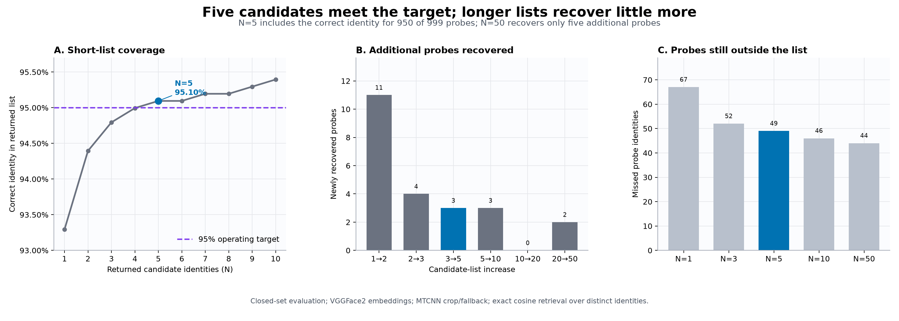
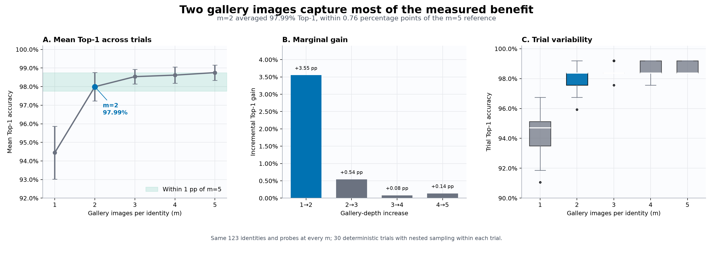
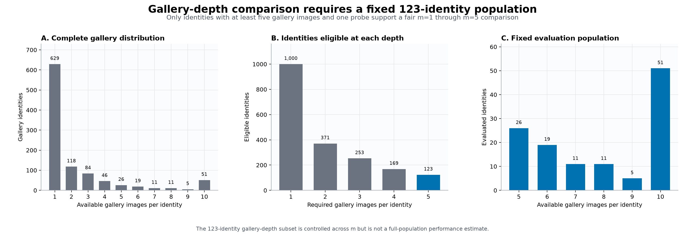

# Experiment 03: Retrieval Configuration

## Decision

The selected face-identification pipeline will return **five distinct identity
candidates by default**. `N=5` is the shortest evaluated list that satisfies the
declared 95% closed-set coverage target: the correct identity appeared within
the first five positions for 950 of 999 probes, or 95.10%.

The measured enrollment recommendation is **two gallery images per identity**
when both are available. Across 30 deterministic trials on a fixed 123-identity
population, `m=2` produced 97.99% mean Top-1 accuracy. That result was 0.76
percentage points below the `m=5` reference and therefore satisfied the
predefined rule of selecting the smallest `m` within one percentage point of
the five-image result.

| Configuration decision | Selected value | Decision evidence |
|---|---:|---|
| Returned identity candidates | `N=5` | First list length reaching 95% coverage |
| Gallery images per identity | `m=2` | Smallest depth within 1 pp of `m=5` mean Top-1 |
| Embedding checkpoint | VGGFace2 | Fixed by Experiment 01 |
| Preprocessing | MTCNN crop/fallback | Fixed by Experiment 02 |
| Search and ranking | Exact cosine; distinct identities | Held constant |

These are operating defaults, not universal thresholds. The candidate target
reflects an explicit product trade-off, while the gallery recommendation is
limited to identities with enough images to support the controlled comparison.

## Why this experiment was necessary

Experiments 01 and 02 established how a face should be represented: VGGFace2
embeddings generated from an MTCNN crop with full-image fallback. They did not
determine how the resulting ranking should be presented or how much enrollment
evidence should represent each identity.

Two otherwise arbitrary settings remained:

1. **Candidate-list length (`N`).** Longer lists recover more correct identities
   but increase the number of candidates a reviewer must inspect.
2. **Gallery depth (`m`).** Additional images can represent more pose, lighting,
   and appearance variation, but increase enrollment effort, storage, and index
   size.

The experiment evaluates these settings separately. `N` changes only how much
of a completed identity ranking is returned. `m` changes how many gallery
images are available to produce that ranking.

## Evaluation design

The candidate-list analysis used the complete selected-pipeline evaluation:
2,265 gallery images representing 1,000 identities and 999 probe images
representing 999 identities. Every probe identity appears in the gallery; one
gallery-only identity remains as a distractor. Image-level cosine results were
collapsed into distinct identities by retaining each identity's highest-scored
gallery image.

Candidate coverage was calculated for every `N` from 1 through 50. The decision
rule was fixed before the canonical run: choose the smallest `N` with Top-N
accuracy of at least 95%.

The gallery-depth analysis required a different controlled population. A fair
`m=1…5` comparison is possible only for identities with at least five gallery
images and a probe. Exactly 123 identities met that rule. The same identities
and probes were retained for every depth.

For each of 30 deterministic seeds, gallery images were shuffled independently
within identity. Samples were nested inside each trial: `m=2` contained the
`m=1` image plus one, `m=3` contained the `m=2` images plus one, and so on. This
produced 150 evaluations—30 trials at each of five gallery depths. The declared
decision rule selected the smallest `m` whose mean Top-1 result was within one
percentage point of the `m=5` mean.

Both analyses reused the verified Experiment 02 embedding caches. Experiment
03 exactly reproduced Experiment 02's selected-pipeline Top-1, Top-3, Top-5,
Top-10, and MRR values before applying either configuration analysis.

## Candidate-list result

*Figure 1. Candidate-list operating trade-off. Five returned identities are
the shortest list meeting the 95% target. Extending the list from five to fifty
recovers only five additional probes while exposing up to 45 more candidates
per request.*

| Candidates (`N`) | Correct probes | Coverage | Missed probes | Recovered since prior reported `N` |
|---:|---:|---:|---:|---:|
| 1 | 932 | 93.29% | 67 | — |
| 2 | 943 | 94.39% | 56 | +11 |
| 3 | 947 | 94.79% | 52 | +4 |
| **5** | **950** | **95.10%** | **49** | **+3** |
| 10 | 953 | 95.40% | 46 | +3 |
| 20 | 953 | 95.40% | 46 | 0 |
| 50 | 955 | 95.60% | 44 | +2 |

The curve shows strong diminishing returns. Moving from one to two candidates
recovers 11 additional probes. Moving from three to five recovers three and is
enough to cross the declared target. Expanding from five to ten recovers three
more; expanding from ten to twenty recovers none; expanding from twenty to
fifty recovers two.

The selected `N=5` does not make the system 95.10% accurate in an open-world
sense. It means that, in this closed-set corpus, the correct enrolled identity
is present somewhere in the first five returned identities for 950 probes. A
reviewer still has to distinguish among those candidates, and no unknown-person
rejection decision is made.

## Gallery-depth result

*Figure 2. Retrieval quality as gallery depth increases. The second image
provides the dominant gain and materially reduces sensitivity to image
selection. Images three through five continue to help, but their incremental
improvements are much smaller.*

| Images per identity (`m`) | Gallery images | Mean Top-1 | Std. dev. | Trial range | Incremental gain |
|---:|---:|---:|---:|---:|---:|
| 1 | 123 | 94.44% | 1.42 pp | 91.06–96.75% | — |
| **2** | **246** | **97.99%** | **0.76 pp** | **95.93–99.19%** | **+3.55 pp** |
| 3 | 369 | 98.54% | 0.39 pp | 97.56–99.19% | +0.54 pp |
| 4 | 492 | 98.62% | 0.43 pp | 97.56–99.19% | +0.08 pp |
| 5 | 615 | 98.75% | 0.41 pp | 98.37–99.19% | +0.14 pp |

The one-image condition depends strongly on which photograph happens to be
selected: individual trials produced between 112 and 119 correct Rank-1
identities out of 123. With two images, the range improved to 118–122 correct.
At five images, every trial produced either 121 or 122 correct.

The result supports two conclusions. First, an additional enrollment image is
valuable because it gives each identity another opportunity to match probe
pose, expression, illumination, or crop variation. Second, requiring five
images for every identity would add enrollment and index cost for less than one
percentage point of mean Top-1 improvement over `m=2`.

## Population context

*Figure 3. Gallery-image availability. Most identities do not have five gallery
images, so the gallery-depth experiment uses a fixed 123-identity subset rather
than changing the evaluated population at each value of `m`.*

The complete gallery is highly imbalanced. Of 1,000 identities, 629 have only
one gallery image and 371 have at least two. The population falls to 253 at
three images, 169 at four images, and 123 at five images.

Using all available identities at each depth would create a biased comparison:
`m=1` would be evaluated on 1,000 identities while `m=5` would be evaluated on
only 123. Keeping the same 123 identities isolates the effect of adding images,
but it also narrows the result's scope. These identities may be easier to match
or better represented than the overall gallery population.

## Engineering impact

The runtime now uses five as the shared default for distinct-identity ranking
and for `/identify` requests that omit `k`. API callers can still request any
positive candidate count explicitly.

Two gallery images are documented as the measured enrollment recommendation,
but the service does not reject identities with one image. Enrollment is
incremental, existing datasets may not satisfy the recommendation, and the
evidence comes from a controlled subset rather than a universal minimum.

The decisions therefore become:

- default candidate-list length: `N=5`;
- measured enrollment target: `m=2` when feasible;
- retain exact cosine retrieval and distinct-identity consolidation;
- preserve explicit `k` overrides for workflows with different review costs.

## Limitations

- The evaluation is closed-set. Every probe identity is enrolled, so it does
  not measure false acceptance or rejection of unknown people.
- The 95% candidate target and one-percentage-point gallery tolerance are
  declared operating choices, not safety guarantees or externally validated
  service-level requirements.
- Candidate count approximates reviewer burden; no human review-time or error
  study was conducted.
- Gallery-depth results use 123 well-represented identities, not all 1,000
  gallery identities.
- Each identity has one probe, limiting within-person probe variation.
- Pretraining identities may overlap with this corpus, so the absolute results
  are not an independent generalization guarantee.
- Exact brute-force retrieval is appropriate at this scale. Larger deployments
  require separate latency, memory, and approximate-index recall evaluation.

## Reproducibility

- Configuration analysis: [`01_analyze_configuration.py`](../../scripts/03_retrieval_configuration/01_analyze_configuration.py)
- Figure generation: [`02_generate_figures.py`](../../scripts/03_retrieval_configuration/02_generate_figures.py)
- Canonical outputs: [`outputs/03_retrieval_configuration`](../../outputs/03_retrieval_configuration/)
- Runtime identity ranking: [`search.py`](../../../identification_service/modules/retrieval/search.py)
- HTTP interface: [`app.py`](../../../identification_service/app.py)

The canonical run used `numpy 2.4.6`. Its manifest records the complete dataset
fingerprint, selected Experiment 02 cache hashes and configurations, exact
baseline-reproduction result, both decision policies, deterministic base seed,
and SHA-256 metadata for every tracked result table.
